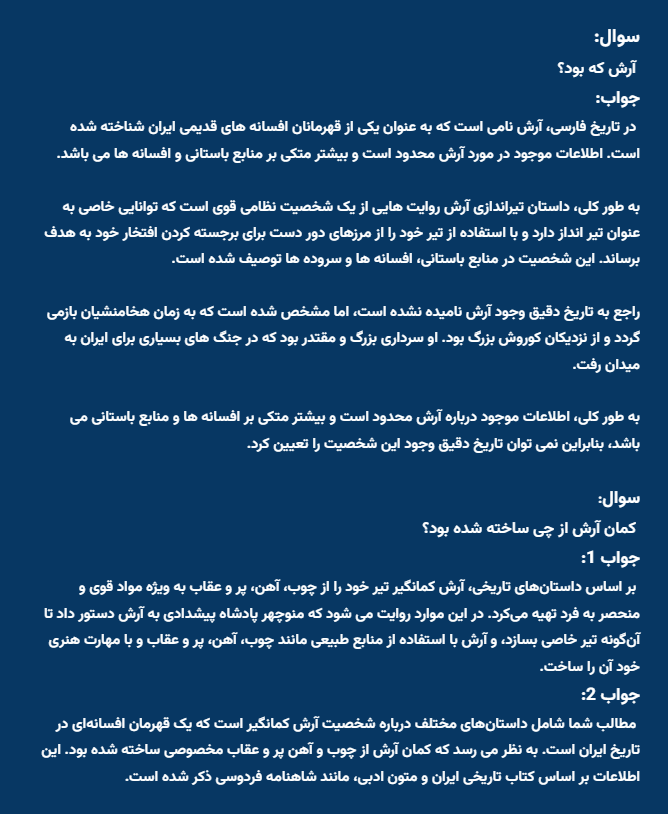

# RAGFA: Retrieval-Augmented Generation for Persian 🎯

RAGFA is a Python-based implementation designed for information retrieval and question-answering in the Farsi language, using advanced natural language processing (NLP) techniques and retrieval-augmented generation (RAG). The system integrates Farsi language embeddings, PDF parsing, vector databases, and a large language model (LLM) to answer queries based on user-provided documents.

## Features
- PDF Parsing: Extracts and preprocesses text from PDF documents.

- Text Preprocessing: Removes unwanted characters, stopwords, emojis, and more, with support for stemming and lemmatization, using **HAZM**.

- Vector Database: Utilizes a vector database for efficient similarity-based retrieval of document chunks, using **Chroma**.

- Multi-query Generation: Generates multiple semantically diverse reformulations of a query for improved retrieval, using **langchain.retrievers.multi_query**.

- Persian Language Support: Built for Persian text processing and query-answering, using **HooshvareLab/bert-fa-zwnj-base embeddings**.

### Libraries
- `hazm`: Persian natural language processing library
- `PyMuPDF` (fitz): PDF parsing
- `langchain`: LLM orchestration
- `transformers`: Hugging Face embeddings
- `chromadb`: Vector database
- `ollama`: Local language model inference

## Output Example:
The model was trained on various documents about **آرش کمانگیر**.
These are some of the input/output examples. You can also see the outputs in `output.txt`.



### Language Model
This project uses Ollama for local inference. Ensure you have the `partai/dorna-llama3:8b-instruct-q4_0` model pulled:

### Embedding Model
Uses `HooshvareLab/bert-fa-zwnj-base` for Persian text embeddings.

### Usage

```python
from rag_system import RAGFA

# Initialize RAG system
pdf_path = 'your_document.pdf'
model_name = 'partai/dorna-llama3:8b-instruct-q4_0'
rag = RAGFA(model_name, pdf_path)

# Ask a query
query = 'آرش که بود؟'
response = rag.invoke(query)
print(response)
```

### Preprocessing Features
The `preprocess` method includes:
- URL removal
- Emoji removal
- Stopword filtering
- HTML tag removal
- Persian text normalization
- Optional lemmatization and stemming

### Retrieval Strategy
- Uses MultiQueryRetriever to generate multiple query variations
- Semantic search with vector embeddings
- Context-aware response generation

### Prompt Engineering
Custom prompt template designed to:
- Simulate a university professor's response
- Focus on extracting information from the specific document
- Provide detailed, context-aware answers

### Potential Improvements
- Support for multiple PDF documents
- More advanced preprocessing
- Fine-tuning embedding models
- Adding caching mechanisms